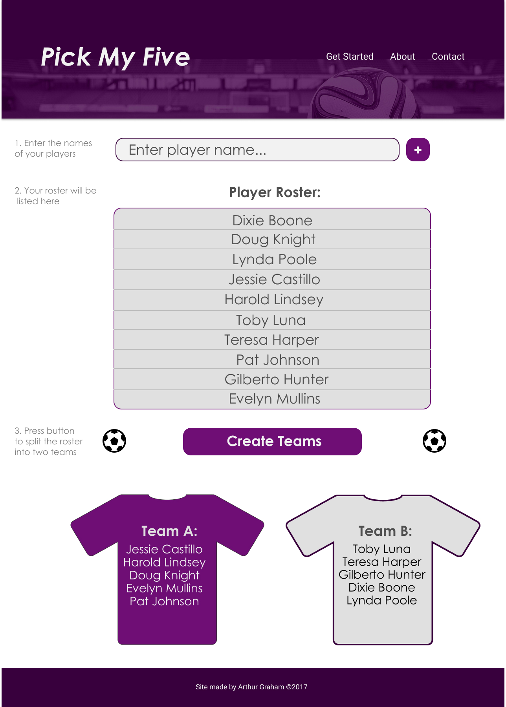
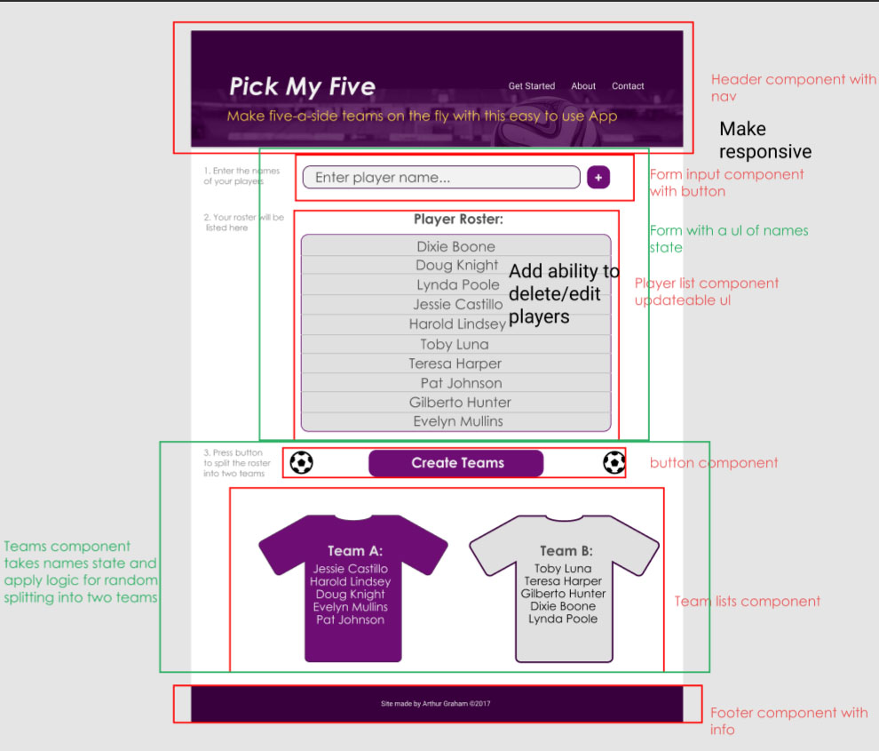
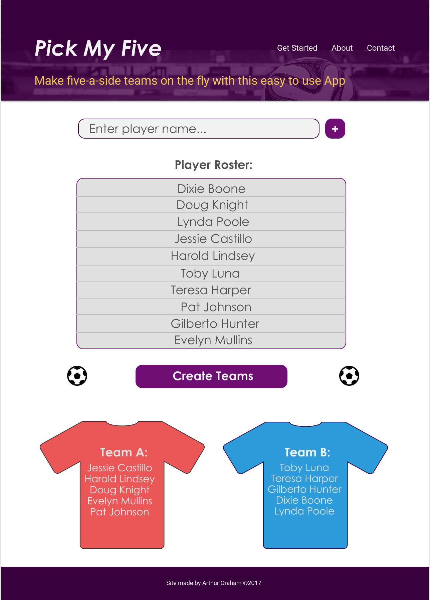

# Pick My Five
### Final project for Develop_Me full stack bootcamp

[Online version of the App](http://arthur.developme.training/pick-my-five/).

## Installation instructions:
- Download the zip file or clone from https://github.com/arthurg90/pick-my-five
- Extract files into /pick-my-five-master

``` shell
$cd ../pick-my-five-master
$npm install
$npm start or $yarn start
```
### Tech used for the app:
- React/Redux
- Html
- CSS/Sass
- Git
- Gulp
- Figma wireframer
- Photoshop

## The brief

The project aim is to create a tool which randomly picks 5-a-side football teams from a list of 10 names. This can be done in various ways: JavaScript, PHP, as a web page, or as an app.

## MVP:
- A Title
- A description
- A ul of 10 names
- A random selector that splits the names into 2 teams of 5 (use JS)
- selector/generator button

## Advanced:

- Support for n a-side
- An ability to add names to the list so the list is of any length
- Support for balancing the teams where some player's strength (average rating/stats) is used to allocate teams fairly


## Project Notes:

Due to time constraints I have decided to create a simple, single page App which satisfies the brief and any advanced features will possibly be implemented in the future version(s). Using React with redux components will be useful for adding features to the app.

Some important considerations for the project included the following features some of which were omitted from the final app due to how the app changed over time.

- Form validation - need some validation for name input such as blank inputs and total number of players
- Color theme/fonts - an overall look of the site/App should be consistent
- Bootstrap - start with bootstrap for built in responsiveness and class names
- Local dev with free hosting later?
- Does the app need API? probably not as it is not storing large amounts of data - just player names and possibly teams.
- React Router - this is a single page app that relies on all the components being displayed at the same time, so routes would not be useful in this instance

Having a strong wireframe and template to follow makes the decision process a lot more structured and organised. Using some rough paper sketches, the following mockup wireframes have been produced:

## Wireframes/Mockups:
- First version showing the colour scheme and layout of the app



- Some notes on the features and breakown of components to use in React



- Final mockup to follow when building the App



## Problems/Solutions encountered during build:

When scaffolding the project out, I started out with too many components for loads of small parts of the site. While this makes sense for a more complex app - it makes this fairly simple app a bit cumbersome and hard to keep track off. It became especially awkward trying to determine which of the dozen components need to be connected to state and which did not. I had to scale back on the number of components/containers to make it more simple and easier to follow.

Git has been valuable for tracking changes and making commit messages. I got into the habit of having a completed task and TODO message on each commit to git, this was especially useful when bringing up git log to check the history. I also had a separate written task list in order of importance to follow a structure.

Complex -> simple tasks. Breaking down big problems into smaller chunks has been valuable to making progress with the App. It can be demotivating when facing a large task such as applying the shuffle logic to randomising the players list. I first made a version using local state only to test it out - I broke the process down into smaller parts - such as first making a list of dummy players saved in local state to test the function. Then I wrote a simple shuffle function to apply to the player list, made a copy of this shuffled list (immutability) and split it into two teams using slice to be saved as team 1 and team 2.

Following the above structure I replaced the local state with the redux store and linked this to the input and player list components of the app so that the players are user generated.

It was challenging at times to follow the redux way of thinking after getting used to React's local state which I became comfortable working with. I had to refer back numerous times to the Develop_Me week 10-12 notes on numerous occassions as well as other online tutorials and diagrams such as these:

https://camo.githubusercontent.com/13227c2a980b327c8efda916f1c47271238a017a/687474703a2f2f692e696d6775722e636f6d2f4455694c39796e2e706e67

## Improvements / Future versions:

If I could improve the app with less time constraints I would like to:

- Include stats/rating system for each player
- Support for n-teams of n-players
- Some balancing logic to be applied based on players skill
- Add an API so that the player teams could be stored more permanently
- Add some animation features
- Improve responsiveness
- Edit players once they've been added to list
